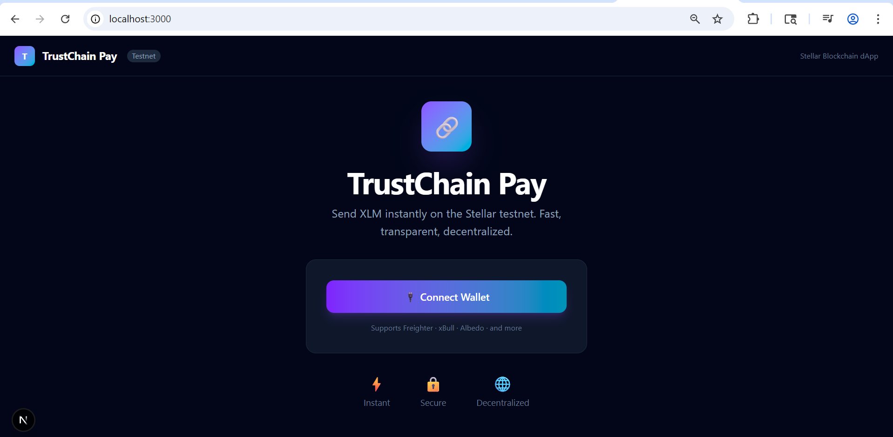

# TrustChain Pay 🔗

> A decentralized payment dApp built on the Stellar blockchain testnet.


## 🌐 Live Demo
👉 https://trustchain-pay-v2.vercel.app

## 📌 Project Description
TrustChain Pay is a complete Stellar blockchain payment dApp. It enables users to connect their Stellar wallet, view their real-time XLM balance, send XLM transactions on testnet, and track their full transaction history — all in a clean, modern interface.

## ✨ Features
- 🔌 Connect / Disconnect Freighter wallet
- 💰 Real-time XLM balance with auto-refresh
- 💸 Send XLM to any Stellar address
- ✅ Transaction success / failure feedback
- 🔗 Transaction hash + Stellar Explorer link
- 📜 Smart contract integration (Soroban)
- 📋 Full transaction history
- ⏳ Loading states and skeletons
- ⚠️ Error handling
- 📱 Responsive design

## 🛠️ Tech Stack
| Technology | Version | Purpose |
|---|---|---|
| Next.js | 16 | React Framework |
| TypeScript | 5 | Type Safety |
| Tailwind CSS | 3 | Styling |
| Stellar SDK | 13 | Blockchain |
| Freighter API | Latest | Wallet Connection |
| React Icons | 5 | Icon Library |

## 📁 Project Structure
```
trustchain-pay-v2/
├── app/
│   ├── globals.css
│   ├── layout.tsx
│   └── page.tsx
├── components/
│   ├── WalletConnection.tsx
│   ├── BalanceDisplay.tsx
│   ├── PaymentForm.tsx
│   ├── TransactionHistory.tsx
│   ├── ContractCall.tsx
│   ├── BonusFeatures.tsx
│   └── example-components.tsx
├── lib/
│   └── stellar-helper.ts
├── contract/
│   └── src/
│       └── lib.rs
├── .github/
│   └── ISSUE_TEMPLATE/
│       ├── bug_report.md
│       └── feature_request.md
└── README.md
```

## 📜 Smart Contract
- Network: Stellar Testnet
- Contract folder: `contract/src/lib.rs`
- Built with Soroban SDK

## 🚀 Setup Instructions

**1. Clone the repository**
```bash
git clone https://github.com/Pritty05/trustchain-pay-v2.git
cd trustchain-pay-v2
```

**2. Install dependencies**
```bash
npm install
```

**3. Run the development server**
```bash
npm run dev
```

**4. Open in browser**
```
http://localhost:3000
```

## 📋 Requirements
- [Freighter Wallet](https://www.freighter.app/) browser extension installed
- Freighter set to **Testnet** network
- Testnet XLM — get free XLM at [Stellar Laboratory](https://laboratory.stellar.org)

## 📸 Screenshots

### Home Page


### Wallet Connected + Balance


### Transaction Successful


### Transaction History


## 🔗 Resources
- [Stellar Docs](https://developers.stellar.org)
- [Stellar Laboratory](https://laboratory.stellar.org) — Fund testnet wallet
- [Stellar Expert](https://stellar.expert/explorer/testnet) — View transactions
- [Freighter Wallet](https://www.freighter.app/)

## 🆘 Troubleshooting
**Wallet won't connect?**
- Make sure Freighter is installed
- Switch Freighter to Testnet network
- Refresh the page

**Balance shows 0?**
- Fund your testnet account at [Stellar Laboratory](https://laboratory.stellar.org)
- Click the Refresh button

**Transaction fails?**
- Keep at least 1 XLM as reserve
- Make sure recipient address is valid
- Confirm you are on Testnet

---
Made with ❤️ for the Stellar Community 🚀